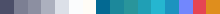

<h3 align="center">
  
</h3>

&nbsp;

  MoeLatte 是基于 <a href="https://catppuccin.com/">Catppuccin Theme</a> 中的 Latte 调色风格制作的一款用于 MoeSkin 皮肤的主题包。

  采用了 Latte 中的绿—蓝系列色作为主要配色，并进行了一定调整。 

&nbsp;

  

&nbsp;

  MoeLatte is a theme for MoeSkin based on Latte flavor in <a href="https://catppuccin.com/">Catppuccin Theme</a>.

  With colors from green to blue in Latte, the theme made some adjustments for convenience of use. 

&nbsp;

  

